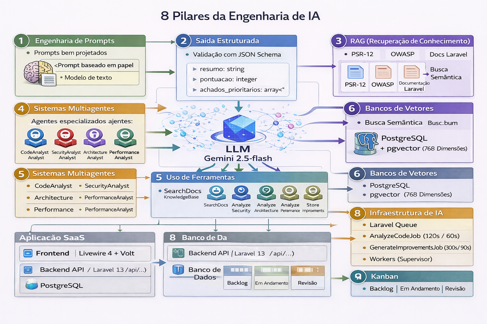

# AI Engineering com Laravel: CodeReview AI

> **CodeReview AI** — Um SaaS de code review inteligente construído com Laravel 13 + **Laravel AI SDK**, que aplica na prática os pilares da **Engenharia de IA**: Agents, Prompt Engineering, RAG, Multi-Agentes, Tool Use e Structured Output.

**Nivel:** Intermediario | **Publico:** Developers PHP/Laravel com interesse em IA
**Custo:** Gratis (Google Gemini free tier) | **Tempo:** ~40-50h



---

## O que e AI Engineering?

**AI Engineering** e a disciplina de **integrar, orquestrar e colocar em producao** modelos de linguagem (LLMs) em aplicacoes de software, sem treinar novos modelos. E engenharia de software aplicada a IA.

### AI Engineer vs Machine Learning Engineer

| Aspecto | ML Engineer | AI Engineer (este tutorial) |
|--------|------------|----------------------------|
| **O que faz** | Treina e otimiza modelos | Orquestra modelos existentes |
| **Linguagem** | Python, PyTorch, JAX | PHP/Laravel, APIs, pgvector |
| **Infraestrutura** | GPUs, datasets, MLOps | APIs, queues, vector databases |
| **Tecnicas** | Fine-tuning, regularization | Prompt engineering, RAG, agents |
| **Timeline** | Meses/anos | Dias/semanas |
| **Demanda 2026** | ~5% developers | ~30-40% developers |

---

## Laravel AI SDK — A Base do Projeto

O **Laravel AI SDK** (`laravel/ai`) e o toolkit oficial first-party do Laravel para IA. Ele oferece:

- **Agents** — Classes PHP autonomas com instructions, tools e structured output
- **Tools** — Function calling: LLM chama funcoes PHP autonomamente
- **Structured Output** — Respostas tipadas com JSON Schema
- **Embeddings** — Geracao de vetores para RAG
- **Streaming** — Respostas em tempo real
- **Conversation Memory** — Persistencia automatica de historico
- **Failover** — Fallback automatico entre providers
- **Testing** — `FakeAi` para testes sem chamar API

```php
// Exemplo: Agent de Code Review com Laravel AI SDK
class SecurityAnalyst implements Agent, HasTools, HasStructuredOutput
{
    use Promptable;

    public function instructions(): string
    {
        return 'You are a Security Expert analyzing code for OWASP Top 10...';
    }

    public function tools(): iterable
    {
        return [new SearchDocsKnowledgeBase];
    }

    public function schema(JsonSchema $schema): array
    {
        return [
            'findings' => $schema->array()->required(),
            'severity' => $schema->string()->required(),
        ];
    }
}

// Uso
$response = (new SecurityAnalyst)->prompt($code, provider: Lab::Gemini);
```

---

## Os 8 Pilares de AI Engineering

### 1. **Prompt Engineering** — Capitulo 8
Escrever instrucoes efetivas para LLMs usando role-based prompts, few-shot examples, templates Blade.

### 2. **Structured Output** — Capitulo 8
Forcar respostas tipadas com JSON Schema via `HasStructuredOutput` — LLM **sempre** responde em formato parseavel.

### 3. **RAG (Retrieval-Augmented Generation)** — Capitulo 9
Buscar documentacao relevante antes de fazer prompt — combater hallucination, garantir accuracy.

### 4. **Multi-Agent Systems** — Capitulo 10
Multiplos Agent classes especializados (ArchitectureAnalyst, PerformanceAnalyst, SecurityAnalyst) operando em paralelo.

### 5. **Tool Use / Function Calling** — Capitulo 10
IA chamando funcoes PHP autonomamente via `HasTools` — LLM decide qual Tool usar baseado no contexto.

### 6. **Vector Databases** — Capitulos 3, 9
pgvector no PostgreSQL com indices HNSW — cornerstone do RAG, busca semantica rapida em producao.

### 7. **Agent Orchestration** — Capitulo 10
Pipeline multi-step: Agent principal chama sub-Agents via Tools, cada um faz RAG, combina resultados.

### 8. **AI Infrastructure** — Capitulos 11, 12
Jobs assincronos via Laravel Queue, Supervisor workers, Docker — manter IA fora do request-response.

---

## Tabela de Pilares vs Capitulos

| Pilar | Capitulo | Voce aprende |
|-------|----------|-------------|
| Prompt Engineering | 8 | Agent `instructions()`, templates Blade, role-based prompts |
| Structured Output | 8 | `HasStructuredOutput`, `JsonSchema`, respostas tipadas |
| RAG | 9 | `Ai::embeddings()`, pgvector, busca semantica |
| Multi-Agents | 10 | 3 Agent classes especializados, `make:agent` |
| Tool Use | 10 | `HasTools`, `make:tool`, function calling automatico |
| Vector Databases | 3, 9 | pgvector, HNSW indices, similarity search |
| Orchestration | 10 | Agent chama Agents via Tools, multi-step pipelines |
| AI Infrastructure | 11, 12 | Queue workers, Supervisor, Docker compose, FakeAi |

## O que voce vai construir

Uma **aplicacao SaaS de AI Engineering completa** que:

1. **Aceita codigo-fonte** via text paste ou URL do repositorio GitHub
2. **Analisa com 3 Agents IA especializados** (Architecture, Performance, Security)
3. **Cada Agent consulta RAG** — busca PSRs, OWASP, Laravel docs relevantes antes de analisar
4. **Gera findings estruturados** com severity labels (low/medium/high/critical)
5. **Produz plano de melhorias** em Kanban interativo (To Do -> In Progress -> Done)
6. **Totalmente gratis** — Google Gemini free tier (250 req/dia, sem cartao)

## Stack Tecnologica

| Camada | Tecnologia | Versao |
|--------|-----------|--------|
| Linguagem | PHP | 8.5 |
| Framework | Laravel | 13 |
| **AI SDK** | **Laravel AI SDK** | **latest** |
| Frontend reativo | Livewire | 4.2 (Volt + Islands) |
| CSS | Tailwind CSS | 4.2 |
| JS | Alpine.js | via Livewire |
| Build | Vite | 8 (Rolldown) |
| Banco de dados | PostgreSQL | 18 |
| Vector DB | pgvector | 0.8.2 (extensao PG) |
| LLM Provider | Google Gemini | gemini-2.5-flash (gratis) |
| Embeddings | Google Gemini | text-embedding-004 (gratis) |
| Testes | Pest | 4.4 |
| Dev Environment | Laravel Sail | 1.54 (Docker) |

## Arquitetura do Sistema

```
+---------------------------------------------------------+
|                    FRONTEND (Livewire 4.2)              |
|  Blade + Alpine.js + Tailwind CSS 4.2 + Dark Mode      |
|  +----------+ +----------+ +----------+ +-----------+  |
|  | Projects | |  Review  | |  Kanban  | |   Admin   |  |
|  +----------+ +----------+ +----------+ +-----------+  |
+---------------------------------------------------------+
|                   BACKEND (Laravel 13)                  |
|  +-------------+  +----------------------------------+  |
|  |  Livewire   |  |         Jobs (Queue)             |  |
|  |   Forms     |  |  +-------------+ +------------+  |  |
|  |  +--------+ |  |  | AnalyzeCode | | Generate   |  |  |
|  |  |Project | |  |  |    Job      | |Improvements|  |  |
|  |  |Review  | |  |  +------+------+ +-----+------+  |  |
|  |  |Login   | |  |         |               |        |  |
|  |  |Register| |  +---------+---------------+--------+  |
|  |  +--------+ |            |               |           |
|  +-------------+            v               v           |
|  +----------------------------------------------------+ |
|  |        AI Agents (Laravel AI SDK)                   | |
|  |  +-------------------+  +------------------------+  | |
|  |  | CodeAnalyst       |  |  CodeMentor            |  | |
|  |  |   Agent           |  |     Agent              |  | |
|  |  |                   |  |  +------------------+  |  | |
|  |  | HasStructured     |  |  | Tools:           |  |  | |
|  |  | Output            |  |  | - Architecture   |  |  | |
|  |  | (gemini-2.5-      |  |  |   Analyst Agent  |  |  | |
|  |  |  flash)           |  |  | - Performance    |  |  | |
|  |  +-------------------+  |  |   Analyst Agent  |  |  | |
|  |                         |  | - Security       |  |  | |
|  |                         |  |   Analyst Agent  |  |  | |
|  |                         |  | - SearchDocs     |  |  | |
|  |                         |  | - StoreImprov.   |  |  | |
|  |                         |  +------------------+  |  | |
|  |                         +------------------------+  | |
|  +----------------------------------------------------+ |
+---------------------------------------------------------+
|                  BANCO DE DADOS                         |
|  +----------------------------------------------------+ |
|  |  PostgreSQL 18 + pgvector                          | |
|  |  +------+ +--------+ +--------+ +--------------+  | |
|  |  |Users | |Projects| |Reviews | | Improvements |  | |
|  |  +------+ +--------+ +--------+ +--------------+  | |
|  |  +------------------+                              | |
|  |  |  DocEmbeddings   | <- vetores text-embedding-004| |
|  |  |(docs/PSRs/OWASP) |   busca por similaridade    | |
|  |  +------------------+                              | |
|  +----------------------------------------------------+ |
+---------------------------------------------------------+
```

## Capitulos do Tutorial

| # | Capitulo | Descricao |
|---|---------|-----------|
| 01 | [Introducao e Visao Geral](docs/01-introducao.md) | O que e o projeto, pilares de AI Engineering, Laravel AI SDK |
| 02 | [Setup do Ambiente](docs/02-setup-ambiente.md) | Docker-first, Sail, .env, dependencias dentro do container |
| 03 | [Banco de Dados e Migrations](docs/03-banco-de-dados.md) | PostgreSQL, pgvector, schema completo e seeders |
| 04 | [Models e Relacionamentos](docs/04-models.md) | Eloquent models, enums, traits e relacoes |
| 05 | [Rotas e Livewire Volt](docs/05-rotas-livewire.md) | Sistema de rotas, Livewire Volt e single-file components |
| 06 | [Design System e Componentes](docs/06-design-system.md) | 20+ componentes Blade, Tailwind 4, dark mode |
| 07 | [Autenticacao](docs/07-autenticacao.md) | Login, registro e middleware de admin |
| 08 | [Agents e Structured Output](docs/08-ia-code-analysis.md) | Laravel AI SDK Agents, `HasStructuredOutput`, analise de codigo |
| 09 | [RAG com pgvector](docs/09-rag-pgvector.md) | `Ai::embeddings()`, busca semantica em documentacoes |
| 10 | [Multi-Agents e Tool Use](docs/10-multi-agentes.md) | 3 Agent classes, `HasTools`, `make:tool`, orquestracao |
| 11 | [Jobs, Filas e Processamento](docs/11-jobs-filas.md) | Queue jobs, processamento assincrono de IA |
| 12 | [Deploy com Docker](docs/12-deploy-docker.md) | Dockerfile multi-stage, compose e producao |
| 13 | [API REST e Swagger](docs/13-api-swagger.md) | Endpoints REST, Sanctum, OpenAPI/Swagger |
| 14 | [Testes Automatizados](docs/14-testes.md) | Unitarios, integracao, funcionais, E2E, performance, smoke |

## Pre-requisitos

- Docker e Docker Compose
- Chave de API do Google Gemini (gratuita em [aistudio.google.com](https://aistudio.google.com/apikey))
- Git
- Conhecimento basico de PHP e Laravel

> **Nao e necessario** ter PHP, Composer ou Node.js instalados localmente. Todo o ambiente roda via Docker.

## Quick Start

```bash
# 0. Criar repositorio e versionar desde o inicio
mkdir laravel_ai && cd laravel_ai
git init && mkdir docs
git add . && git commit -m "chore: init project structure"
gh repo create codereview-ai --public --source=. --push

# Proteger a branch main no GitHub:
# Settings > Branches > Add ruleset > Require PR before merging

# Criar branch para o capitulo 2
git checkout -b feat/cap02-setup

# 1. Criar projeto Laravel via Docker (nada instalado no host)
curl -s "https://laravel.build/codereview-ai?with=pgsql,redis" | bash
cd codereview-ai

# 2. Trocar imagem do PostgreSQL para pgvector no compose.yaml
# Altere: image: 'postgres:18-alpine' -> image: 'pgvector/pgvector:pg18'

# 3. Configurar .env (Laravel 13 vem com SQLite por padrao, precisa mudar para pgsql)
# Substitua o bloco DB_ no .env por:
#   DB_CONNECTION=pgsql
#   DB_HOST=pgsql
#   DB_PORT=5432
#   DB_DATABASE=laravel
#   DB_USERNAME=sail
#   DB_PASSWORD=password
# Tambem ajuste o Redis:
#   REDIS_HOST=redis
# E adicione sua chave Gemini:
#   GEMINI_API_KEY=AIza-sua-chave (gratis em aistudio.google.com)
#   AI_PROVIDER=gemini
#   GEMINI_MODEL=gemini-2.5-flash

# 4. Subir containers Docker (se ja subiu antes com postgres, rode: sail down -v primeiro)
./vendor/bin/sail up -d

# 5. Instalar dependencias (DENTRO do container)
./vendor/bin/sail artisan key:generate
./vendor/bin/sail composer require laravel/ai pgvector/pgvector livewire/livewire
./vendor/bin/sail artisan vendor:publish --provider="Laravel\Ai\AiServiceProvider"
./vendor/bin/sail artisan migrate
./vendor/bin/sail npm install && ./vendor/bin/sail npm run dev

# 6. Acesse http://localhost

# 7. Versionar via branch + PR (nunca push direto na main)
cd ..  # volta para laravel_ai/
git add .
git commit -m "feat: setup completo com laravel/ai, pgvector e livewire"
git push -u origin feat/cap02-setup
gh pr create --title "feat: setup do ambiente" --body "Capitulo 02 completo"
# Merge o PR no GitHub, depois:
git checkout main && git pull
```

## Licenca

Este tutorial e open source e livre para uso educacional.
